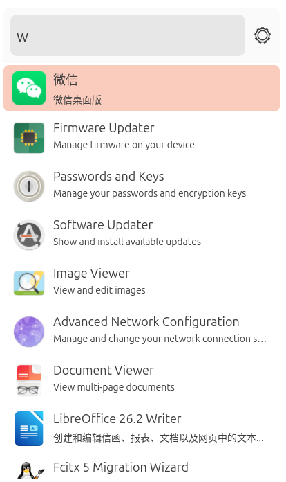
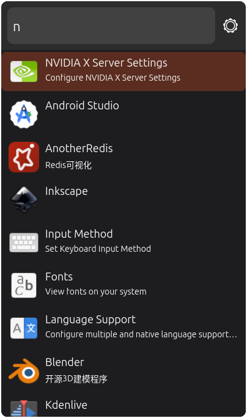
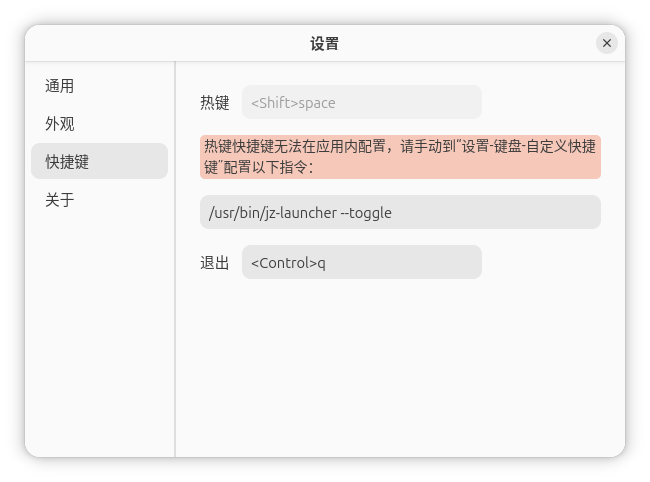
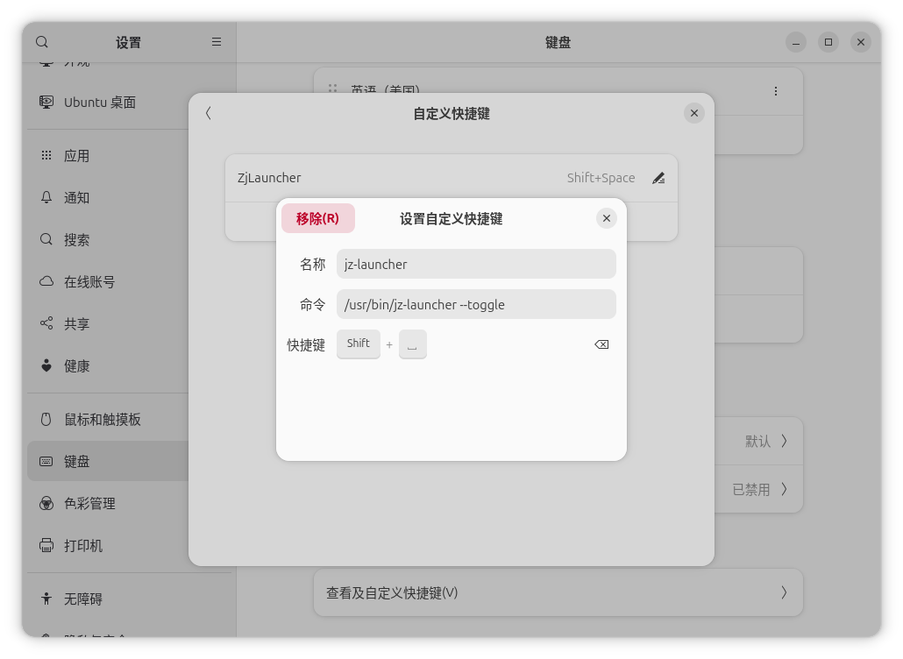

# JzLauncher

一个使用 Rust、GTK 4 和 libadwaita 开发的 Linux 桌面应用启动器。通过系统全局快捷键唤出窗口，输入应用名称即可快速搜索并启动已安装的桌面应用。

| 浅色主题                                                     | 深色主题                                                     |
| ------------------------------------------------------------ | ------------------------------------------------------------ |
|  |  |

## 系统要求

- Linux 桌面环境（X11 或 Wayland）

项目主要在 Ubuntu 26.04 LTS、GNOME 和 Wayland 环境下开发。其他发行版或桌面环境的 GTK 主题、图标及系统快捷键设置入口可能有所不同。

## 安装

前往 [Releases](https://github.com/zhoujing2023/jz-launcher/releases) 下载适合当前系统和架构的软件包。

| 格式 | 适用场景 | 安装或运行方式 |
| --- | --- | --- |
| `.deb` | Debian、Ubuntu 及其衍生发行版 | 使用 APT 安装 |
| `.rpm` | Fedora、RHEL、Rocky Linux 等发行版 | 使用 DNF/RPM 安装 |
| `.AppImage` | 无需安装，便携运行 | 添加执行权限后通过命令行运行 |
| `.tar.gz` | 从源码构建或二次开发 | 解压后使用 Cargo 构建 |

### deb

```bash
sudo apt install ./jz-launcher_*.deb
```

安装完成后可以从应用菜单启动，也可以执行：

```bash
/usr/bin/jz-launcher --toggle
```

### rpm

Fedora、RHEL 及兼容发行版可执行：

```bash
sudo dnf install ./jz-launcher-*.rpm
```

安装完成后的启动命令同样是：

```bash
/usr/bin/jz-launcher --toggle
```

### AppImage

AppImage 无需安装。下载后先添加执行权限：

```bash
chmod +x ./jz-launcher_*.AppImage
```

> [!IMPORTANT]
> 直接双击 AppImage 不会显示 JzLauncher 窗口，这并不表示程序损坏或启动失败。当前 AppImage 必须通过命令行运行，并在文件名后追加 `-- --toggle` 参数。

```bash
./jz-launcher_*.AppImage -- --toggle
```

其中第一个 `--` 用于将后面的 `--toggle` 转交给 AppImage 内部的 JzLauncher 程序。

### 源码包（.tar.gz）

解压从 Releases 下载的源码包：

```bash
tar -xzf jz-launcher-*.tar.gz
cd jz-launcher-*/
```

Debian/Ubuntu 构建依赖：

```bash
sudo apt update
sudo apt install build-essential pkg-config libgtk-4-dev libadwaita-1-dev
```

安装 Rust 1.85 或更高版本后执行：

```bash
cargo build --release -p launcher-gui
./target/release/jz-launcher --toggle
```

更完整的安装、构建和四种发布包的制作说明请参阅 [INSTALL](INSTALL)。

## 配置全局快捷键

GTK 应用内快捷键只能在应用获得键盘焦点时触发，无法直接从其他应用中唤起已隐藏的窗口。因此需要使用桌面环境提供的“自定义快捷键”功能。

deb 和 rpm 安装后的快捷键命令为：

```text
/usr/bin/jz-launcher --toggle
```

AppImage 必须使用文件的绝对路径，并保留两个连续参数：

```text
/绝对路径/jz-launcher_版本_架构.AppImage -- --toggle
```

以 GNOME 为例：

1. 启动 JzLauncher 并打开“设置 → 快捷键”。

2. 复制界面中显示的命令。

   

3. 打开系统“设置 → 键盘 → 键盘快捷键 → 自定义快捷键”。

4. 新建快捷键、粘贴命令并设置希望使用的组合键。



不同桌面环境的菜单名称可能不同。从源码运行时，需要将命令替换为 `target/release/jz-launcher --toggle` 的绝对路径。

## 使用方法

唤出 JzLauncher 后输入应用名称：

- `↑` / `↓`：切换搜索结果
- `Enter`：启动当前选中的应用
- `Esc`：隐藏启动器窗口
- 鼠标双击搜索结果：启动对应应用

如果某个应用没有出现在搜索结果中，可以在“设置 → 通用”中检查或补充其 `.desktop` 文件所在目录。

默认扫描目录包括：

```text
/usr/share/applications
/var/lib/snapd/desktop/applications
~/.local/share/applications
~/桌面
```

## 配置文件

用户配置保存在：

```text
~/.config/jz-launcher/config.json
```

配置包含 `.desktop` 扫描路径、主题模式、字体大小和应用内退出快捷键。通常建议通过设置界面修改，而不是直接编辑该文件。

## 项目结构

```text
jz-launcher/
├── launcher-core/   # .desktop 加载、搜索和应用启动等核心逻辑
├── launcher-gui/    # GTK 4 / libadwaita 图形界面
├── docs/images/     # README 演示图片
├── scripts/         # 源码发布包生成脚本
├── COPYING          # MIT 许可证
└── INSTALL          # 安装与打包说明
```

运行检查和测试：

```bash
cargo check --workspace
cargo test --workspace
```

## 参与贡献

欢迎通过 [Issues](https://github.com/zhoujing2023/jz-launcher/issues) 报告问题或提出建议，也欢迎提交 Pull Request。提交代码前请确保 `cargo fmt --check`、`cargo clippy --workspace` 和 `cargo test --workspace` 能够通过。

## 许可证

本项目基于 [MIT License](COPYING) 开源。
